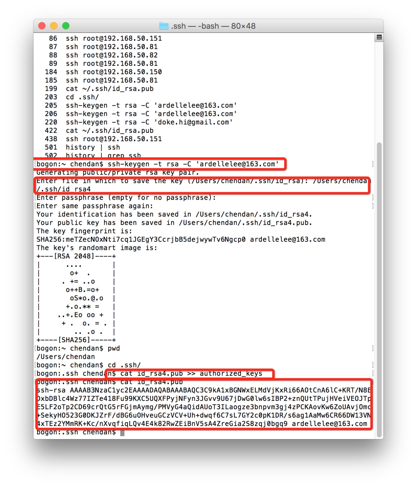

# 项目概述

这部分主页就是为了创建通用于github以及bitbucket的ssh登陆方式 此章节只接受bitbucket github的流程类似

## 创建本地ssh key

### 1、认识ssh目录以及工作目录

ssh key在unix like 包括linux macos等系统都是保存在当前登录用户目录下,即 ~/.ssh/目录,普通用户非Root用户的工作目录位于
/home/xxxx/,root用户的工作目录位于/root/,因此对于普通用户的ssh key保存的绝对路径为/home/xxx/.ssh/,如下代码
```
bogon:.ssh chendan$ cd
bogon:~ chendan$ pwd
/Users/chendan
bogon:~ chendan$ cd ~/.ssh/
bogon:.ssh chendan$ pwd
/Users/chendan/.ssh
bogon:.ssh chendan$
```


### 2、创建key

利用ssh-keygen创建ssh key 保存在~/.ssh/目录下 在创建的时候需要输入希望保存的key文件名 如果不输入则会保存为id_rsa.pub 
如此以来就会没次新创建的key会把上次创建的key覆盖 上次的key失效
其次 创建完了以后需要将key加载到 authorized_keys文件 该文件在~/.ssh/目录下 是所有公钥的保存文件 使用 >> 链接符是希望
将新创建的id_rsa4.pub公钥放置到 authorized_keys文件的后面
```
bogon:~ chendan$ ssh-keygen -t rsa -C 'ardellelee@163.com'
Generating public/private rsa key pair.
Enter file in which to save the key (/Users/chendan/.ssh/id_rsa): /Users/chendan/.ssh/id_rsa4
Enter passphrase (empty for no passphrase): 
Enter same passphrase again: 
Your identification has been saved in /Users/chendan/.ssh/id_rsa4.
Your public key has been saved in /Users/chendan/.ssh/id_rsa4.pub.
The key fingerprint is:
SHA256:meTZecNOxNti7cq1JGEgY3CcrjbB5dejwywTv6Ngcp0 ardellelee@163.com
The key's randomart image is:
+---[RSA 2048]----+
|      ....       |
|       o+  .     |
|     . += ..o    |
|      o++B.=o+   |
|       oS*o.@.o  |
|      +.o.** =   |
|    ..+.Eo oo +  |
|     + .  o. = . |
|        .. .o .  |
+----[SHA256]-----+
bogon:~ chendan$ pwd
/Users/chendan
bogon:~ chendan$ cd .ssh/
bogon:.ssh chendan$ cat id_rsa4.pub >> authorized_keys 
bogon:.ssh chendan$ 

```

### 3、创建的key添加bitbucket

首先你的将本地添加到authorized_keys里的公钥拿到
```
bogon:.ssh chendan$ cat id_rsa4.pub
ssh-rsa AAAAB3NzaC1yc2EAAAADAQABAAABAQC3C9kA1xBGNWxELMdVjKxRi66AOtCnA6lC+KRT/N8EDxbDBlc4Wz77IZTe418Fu99KXC5UQXFPyjNFyn3JGvv9U67jDwG0lw6sIBP2+znQUtTPujHVeiVEOJTpE5LF2oTp2CD69crQtG5rFGjmAymg/PMVyG4aQidAUoT3ILaogze3bnpvm3gj4zPCKAovKw6ZoUAvjOmc+SekyHO523G0DKJZrF/dBG6uOHveuGCzVCV+Uh+dwqf6C7sL7GY2c0pK1DR/s6ag1AaMw6CR66DW13VN4xTEz2YMmRK+Kc/nXvqfiqLQv4E4k82RwZEiBnV5sA4ZreGia2S8zqj0bgq9 ardellelee@163.com
```
拷贝cat id_rsa4.pub输出的结果


打开bitbucket.com


